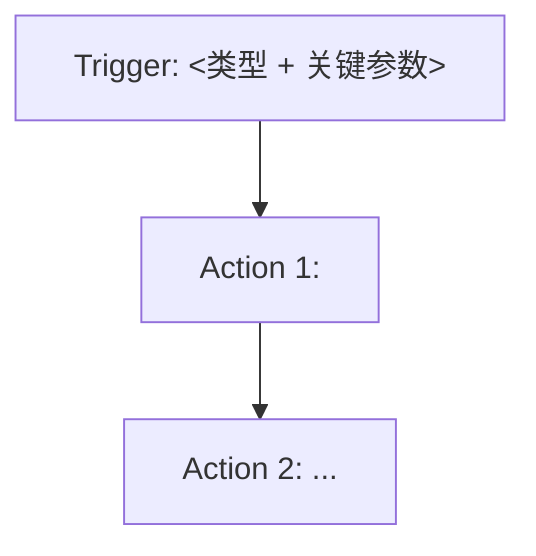

# /create-flow — 端到端 flow 生成 SOP

> **本 skill 是项目核心**。任何生成 flow 的请求都必须按此 SOP 执行，**不允许凭记忆直接拼 clientdata**。

---

## 触发条件

用户原话出现以下任一：
- "创建 flow" / "生成 flow" / "部署 flow"
- "create flow" / "deploy flow" / "build a flow"
- "做一个 Power Automate 自动化"
- 描述了一个明显的"触发器 + 动作"自动化场景

---

## 前置 Skill（必须先有）

- `/describe-component` — 查组件库
- `/learn-component` — 学新组件（当 describe 找不到时）
- `/configure-profile` — 配置环境凭据（用户第一次用时必跑）

---

## 4 步强制契约

### Step 1 — 生成原型，让用户确认（**禁止跳过**）

不允许立刻写 clientdata。必须先输出：

````markdown
**Flow 原型**



**节点清单**：
| # | 类型 | Connector / 内置 | Operation | 关键参数 |
|---|---|---|---|---|
| T | trigger | shared_office365 | OnNewEmailV3 | folder=Inbox |
| 1 | action | builtin | Compose | ... |

**确认点**：
1. 触发器选 X 是否正确？
2. Action 顺序 / 分支 OK 吗？
3. 哪些参数需要你提供具体值？
````

→ **等用户回 "OK / 改 X"**，不确认不进下一步。

---

### Step 2 — 每个节点先调 `/describe-component`（**逐个**）

对原型里**每个 trigger 和 action**：

```
/describe-component shared_<connector> <operationId>
```

- ✅ 找到 → 拿到 inputSchema / outputSchema / 已知坑 / graphTemplate
- ❌ 找不到 → **跳到 Step 3 学习**，禁止凭记忆编参数

---

### Step 3 — 缺组件时强制 `/learn-component`

```
/learn-component shared_<connector> <operationId>
```

学完后**回到 Step 2** 重新 describe 那个节点。

**不允许的偷懒**：
- ❌ "我大致记得这个 operation 的参数是 ..."
- ❌ "用 HTTP action 兜底就行"
- ❌ "先部署看报错"

---

### Step 4 — 拼装 + 部署

只有 Step 1-3 全过才能：

1. **拼 clientdata JSON**（用每个组件的 `template` 字段填参数）
2. **选 profile + env，拿 token**：
   ```powershell
   # 从当前 profile（默认 profiles/<tenant>.json）读 env：
   #   - 用户说了 “在 prod / --env prod” → 用该 env
   #   - 没说 → 用 $profile.defaultEnvironment
   # 拿 Dataverse access token（本 skill 的主要 token）：
   $dvToken = (python scripts/configure_profile.py "profiles/<tenant>.json" --env <envName> --get-token)[-1]

   # 如果还需 Flow Management / Graph / PowerApps API，参考
   # `.github/instructions/token-management.instructions.md` 中的 4-scope 批量模板
   ```
   详见 `token-management.instructions.md` 的 “Profile schema 速读” + “一次性批量刷多 scope” 节。
3. **查 connectionReference**（从 Dataverse `{orgUrl}/api/data/v9.2/connectionreferences`）
4. **POST Flow Management API**：
   ```powershell
   POST https://api.flow.microsoft.com/providers/Microsoft.ProcessSimple/environments/{envId}/flows?api-version=2016-11-01
   Authorization: Bearer $flowToken
   ```
   `{envId}` = 上面选中的 env 的 `environmentId`。
5. **Workflow 类型额外步骤**：
   - 调 `scripts/definition_to_graph.py` 生成 `associatedData.graph`
   - 部署后 PATCH Dataverse `modernflowtype=1` 切换 Copilot Studio Plan
6. **命名约束**：`displayName` 必须以 `[AutoGen]` 开头（项目硬约束）
7. **flow JSON 落盘**：写到 `flows/{envName}/{flow|workflow}/<flow名>.json`

---

## 成功标志（AI 必须自检后才能说"完成"）

- [ ] 用户确认了原型
- [ ] 每个节点都有对应的组件（不是凭记忆）
- [ ] POST 返回 201 + 拿到 `flowId`
- [ ] Power Automate Portal 能看到该 flow
- [ ] 用户拿到 flowId + portal 链接

任何一项缺 → 必须报告"未完成"，不要谎报。

---

## 禁止事项

- ❌ 跳过 Step 1 直接给 clientdata
- ❌ 凭记忆编 connector 参数
- ❌ POST 报错就改 displayName 再 POST（旧 flow 不删，污染环境）
- ❌ 给 flow 起的名字不带 `[AutoGen]` 前缀
- ❌ 任何 `DELETE` flow 或 connectionReference 的操作（项目硬约束）
- ❌ 用 `contains` 模糊匹配 Dataverse 查询（必须 `eq` 精确）

---

## 同步到 DevTool

成功验证一条新 flow / 学到新踩坑后，提示用户跑 `/sync-to-devtool`，把脱敏后的 components/scripts/instructions 推到公开仓。
